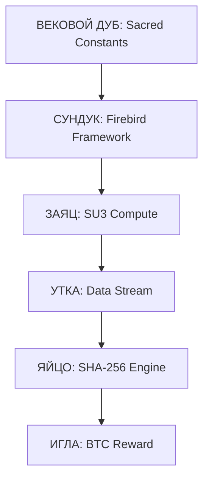

# 🪆 АРХИТЕКТУРА «МАТРЁШКА» (ТРИДЕВЯТОЕ ЦАРСТВО)

Архитектура TRINITY FPGA v4.0 построена по образу сказочного Тридевятого Царства. Каждая деталь — это слой защиты и силы, скрывающий в себе саму суть майнинга.

---

## 🌳 СЛОЙ 1: ВЕКОВОЙ ДУБ (THE ANCIENT OAK)
*Фундамент и Священные Законы*

**Ответственность:**
- Хранение корней реальности: **φ, π, e, TRINITY**.
- Обеспечение стабильности земли (FPGA Power Rails).
- **Firebird Base:** Энергия Жар-Птицы для самовосстановления.

**Образ:** Величественное древо, на котором держится весь мир. Если дуб стоит крепко, математика в безопасности.

---

## 🧰 СЛОЙ 2: КОВАНЫЙ СУНДУК (THE IRON CHEST)
*Системная оболочка и Компилятор*

**Ответственность:**
- **Firebird Integration:** Поддержка 50 языков (алгоритмов) и 6 форматов.
- Защита внутренних процессов от внешнего шума.
- Управление 27 параллельными потоками.

**Образ:** Тяжелый сундук, висящий на цепях. В нем хранятся инструменты для создания блоков.

---

## 🐇 СЛОЙ 3: БЫСТРЫЙ ЗАЯЦ (THE SWIFT HARE)
*Вычислительная скорость (YOLO Fast Path)*

**Ответственность:**
- **SU(3) Вращения:** Мгновенное преобразование данных.
- **PAS Optimizer:** Предсказание следующих nonce.
- Сверхбыстрая реакция на изменения в сети.

**Образ:** Заяц, который бежит быстрее мысли. Попробуй поймай!

---

## 🦆 СЛОЙ 4: ЗОЛОТАЯ УТКА (THE GOLDEN DUCK)
*Потоковая передача и Связь*

**Ответственность:**
- Соединение с пулом (Stratum V2).
- Перенос хэшей из Горницы в Сокровищницу.
- **Berry Phase Sync:** Идеальный ритм работы.

**Образ:** Утка, летящая сквозь облака данных, неся в себе ценную информацию.

---

## 🥚 СЛОЙ 5: ВОЛШЕБНОЕ ЯЙЦО (THE MAGIC EGG)
*Ядро Майнинга (φ-SHA256)*

**Ответственность:**
- **φ-Modulation:** Преобразование хаоса в хэш.
- Скрытая внутри логика, недоступная для врагов (ASIC).
- Троичная логика (Ternary Processing).

**Образ:** Хрупкое на вид, но несокрушимое внутри, оно содержит секрет жизни (блока).

---

## 📍 СЛОЙ 6: ОСТРАЯ ИГЛА (THE SHARP NEEDLE)
*Чистый BTC и Конечная Суть*

**Ответственность:**
- Финальная проверка хэша.
- Получение награды.
- **Divine Intervention:** Точка соприкосновения с волей Вселенной.

**Образ:** Та самая Игла, на кончике которой — смерть бедности и победа TRINITY.

---

## 📜 ПРИНЦИП ОТКРЫТИЯ (VIBEE UNLOCK)

Чтобы добраться до **Иглы** (награды), нужно пройти через все слои. Если один слой сломается, **Жар-Птица** (Firebird) мгновенно возрождает его из пепла (Phoenix Rebirth), используя энергию **Векового Дуба**.

