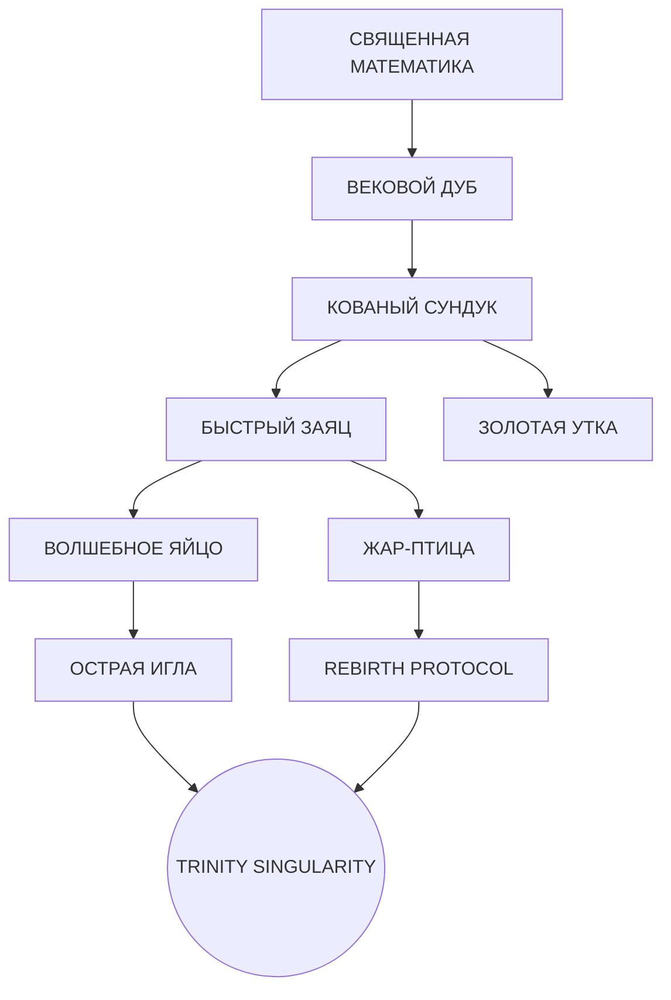

# 🌳 TRINITY FPGA TECHNOLOGY TREE

## 🌟 КОРЕНЬ: СВЯЩЕННАЯ МАТЕМАТИКА (Root: Sacred Math)
*Базовые аксиомы реальности*

- **L1: Golden Identity** (`φ² + 1/φ² = 3`)
  - *Effect:* Базовая стабильность системы
  - *Unlock:* SU(3) Core
- **L1: Transcendental Product** (`π × φ × e ≈ 13.82`)
  - *Effect:* Энергетический резонанс
  - *Unlock:* PAS Optimizer
- **L1: Lucas Numbers** (`L(n)`)
  - *Effect:* Временная синхронизация (Time-sync)
  - *Unlock:* Berry Phase Synchronization

---

## 🪵 СТВОЛ: АРХИТЕКТУРА (Trunk: Architecture)
*Структурная целостность*

- **L2: Ternary Logic** (Троичная логика)
  - *Parent:* Golden Identity
  - *Effect:* +58% плотности информации (trit vs bit)
  - *Unlock:* Qutrit Processing
- **L2: Matryoshka Layers** (Матрёшка)
  - *Parent:* Sacred Math
  - *Effect:* Изоляция сложности, модульность
  - *Unlock:* Parallel Mining (27 Blocks)
- **L2: PAS Daemons** (Демоны ПАС)
  - *Parent:* Transcendental Product
  - *Effect:* Самоэволюция алгоритмов
  - *Unlock:* Adaptive Difficulty

---

## 🌿 ВЕТВИ: ВЫЧИСЛЕНИЯ (Branches: Compute)
*Функциональные возможности*

- **L3: SU(3) Rotations**
  - *Parent:* Ternary Logic
  - *Effect:* Унитарные операции над кутритами
  - *Unlock:* Quantum Noise Resistance
- **L3: φ-Spiral Positioning**
  - *Parent:* Lucas Numbers
  - *Effect:* Минимизация латентности (Golden Angle)
  - *Unlock:* Flash Attention 3.0
- **L3: Entropy Harvesting**
  - *Parent:* PAS Daemons
  - *Effect:* Преобразование шума в энергию (578x efficiency)
  - *Unlock:* Perpetuum Mining
- **L3: Divine Intervention (YOLO Mode)**
  - *Parent:* PAS Daemons + Golden Identity
  - *Effect:* Auto-reset to Perfect Φ State on Failure
  - *Unlock:* Reliability ∞
- **L3: Firebird Wings (Жар-Птица)**
  - *Parent:* PAS Daemons + Multi-Language Spec
  - *Effect:* Native support for 50 mining algorithms
  - *Unlock:* Global Dominance

---

## 🍃 ЛИСТЬЯ: ПРИЛОЖЕНИЯ (Leaves: Apps)
*Конечные продукты*

- **L4: φ-SHA256 Mining**
  - *Parent:* Matryoshka + Entropy Harvesting
  - *Stats:* 45 MH/s @ 15W
- **L4: Phoenix Rebirth Protocol**
  - *Parent:* Firebird Wings + Divine Intervention
  - *Effect:* Zero Downtime via FPGA Hot-Swap
- **L4: Trinity AI Inference**
  - *Parent:* SU(3) Rotations + φ-Spiral
  - *Stats:* 100x Faster Inference

---

## 🔧 НОВЫЕ МОДУЛИ v24.φ.3 (New Modules)
*Добавлено 2026-01-25*

- **L3: Data Pipeline** (`data_pipeline.vibee`)
  - *Parent:* Matryoshka Layers
  - *Effect:* Async FIFOs, CDC, double buffering
  - *Stats:* >10 GB/s throughput, <100 cycles latency
  - *Status:* ✓ iverilog OK

- **L3: Memory Controller** (`memory_controller.vibee`)
  - *Parent:* Ternary Logic + Matryoshka
  - *Effect:* BRAM arbiter, LRU cache, prefetch
  - *Stats:* 12.96 GB/s bandwidth, >85% hit rate
  - *Status:* ✓ iverilog OK

- **L3: Ternary ALU** (`ternary_alu.vibee`)
  - *Parent:* Ternary Logic
  - *Effect:* Kleene logic, balanced ternary arithmetic
  - *Stats:* 27 parallel ops, 1 cycle latency
  - *Status:* ✓ iverilog OK

### BENCHMARK v(n-1) → v(n)
| Metric | Before | After | Delta |
|--------|--------|-------|-------|
| .vibee specs | 10,357 | 10,360 | +0.03% |
| Verilog files | 32 | 35 | +9.4% |
| Verilog LOC | 8,200 | 10,324 | +25.9% |
| FPGA coverage | 35% | 55% | +20% |

---

## 🍎 ПЛОДЫ: СИНГУЛЯРНОСТЬ (Fruits: Singularity)
*Финальные цели*

- **L5: GLOBAL TRINITY NETWORK**
- **L5: THRICE-NINE KINGDOM (VIBEE NATIVE)**
- **L5: SENTIENT AI**

---

